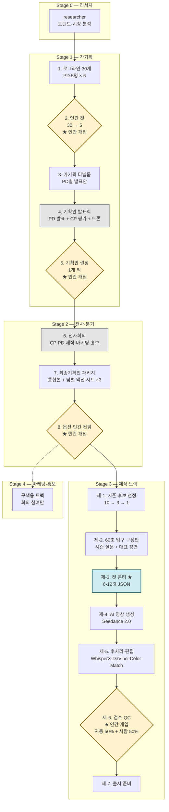

# PIPELINE.md — 1주기 워크플로우 풀버전

기획·발표·전사회의·제작·QC·출시까지 한 사이클을 멀티 에이전트로 돌리는 파이프라인.

## 전체 다이어그램



**노란색 = 인간 개입 4곳** ([2], [5], [8], [제-6]).
**파란색 = 컷 콘티 [제-3]** — 가설 1의 핵심 단계.
**회색 = 동기 회의** (PD 발표·CP 평가·전사 합류).

---

## Stage 0 — 리서치

### researcher
페르소나: `personas/researcher.md`.
입력: 채널 정체성, 직전 사이클 인사이트, 시즌 주제 후보.
출력 스키마:

```json
{
  "research_id": "cycle-001-research",
  "queries": ["AI 영상 생성 트렌드 2026", "..."],
  "findings": [
    {
      "topic": "...",
      "summary": "...",
      "sources": ["url1", "url2"],
      "relevance_score": 0.0-1.0
    }
  ],
  "trend_signals": ["..."],
  "blind_spots": ["..."]
}
```

---

## Stage 1 — 가기획

### [1] 로그라인 30개

PD 5명이 각 6개씩 도출.

```json
{
  "logline_id": "pd2-5",
  "pd_persona": "pd2_science",
  "logline": "한 줄",
  "research_summary": "...",
  "why_good": "...",
  "sources": ["url1", "url2"],
  "ai_necessity": "AI 아니면 불가능한 이유",
  "ebs_fit_score": 0-10,
  "novelty_score": 0-10
}
```

PD별 다른 강점 영역(역사·과학·사회·글로벌·디지털) + 다른 temperature(0.75/0.85)로 결이 갈린다. 이게 가설 2(워크플로우 설계 = PD 채용)의 출발점.

### [2] ★ 인간 컷 30 → 5

CP가 5축 점수로 30개 평가, 사용자가 PD별 1개씩 선택해 5개로 압축.
인간 개입 1: PD 결과를 사람이 평가·선별. → 자세한 가이드 [docs/HUMAN_INTERVENTION.md](./docs/HUMAN_INTERVENTION.md).

```json
{
  "human_cut_id": "pd-1to5",
  "selected_loglines": ["pd1-3", "pd2-5", "pd3-5", "pd4-1", "pd5-1"],
  "rationale": "..."
}
```

### [3] 가기획 디벨롭

PD가 자기 안건을 발표안 형식으로 디벨롭.

```json
{
  "develop_id": "pd2-5",
  "logline_id": "pd2-5",
  "season_arc": "8부작 에피소드 맵",
  "first_episode_skeleton": "...",
  "60s_entry_concept": "...",
  "key_visuals": ["..."],
  "fact_check_targets": ["..."]
}
```

### [4] 기획안 발표회 (동기 회의)

PD 5명이 자기 안건을 발표 → CP가 5축 점수 + 코멘트 → PD끼리 토론.

```json
{
  "conference_id": "conf-001",
  "agenda": "presentation",
  "presentations": [{ "pd": "pd2", "summary": "..." }],
  "cp_scores": [{ "develop_id": "pd2-5", "scores": {...} }],
  "discussion": ["..."],
  "shortlist": ["pd2-5", "pd3-5", "pd5-1"]
}
```

### [5] ★ 기획안 결정 1개 픽

사용자가 최종 1개 픽. 인간 개입 2.

---

## Stage 2 — 전사·분기

### [6] 전사회의

CP·PD + 제작팀 + 마케팅팀 + 홍보팀 합류.
안건: 타겟·편성·마케팅·톤. 플랫폼 픽스 (예: 유튜브).

### [7] 최종기획안 패키지

통합본 + 팀별 액션 시트 ×3 (제작·마케팅·홍보).

```json
{
  "package_id": "cycle-001",
  "concept": "...",
  "production_sheet": {...},
  "marketing_sheet": {...},
  "pr_sheet": {...}
}
```

### [8] (옵션) 인간 컨펌

인간 개입 3.

---

## Stage 3 — 제작 트랙

### [제-1] 시즌 후보 선정

20분 × 8부작 시즌으로 확장 가능한 주제 10개 → 3개 숏리스트 → 1개 픽.

### [제-2] 60초 입구 구성안

시즌 질문 + 대표 장면 + 20분 확장 암시.

### [제-3] 컷 콘티 ★

**가설 1의 핵심 단계.** 6-12컷 JSON. 컷당 4-15초.

```json
{
  "episode_id": "ep01",
  "duration_sec": 180,
  "cuts": [
    {
      "cut_no": 1,
      "duration_sec": 15,
      "beats": [
        { "beat_no": 1, "duration_sec": 5, "action": "..." },
        { "beat_no": 2, "duration_sec": 5, "action": "..." },
        { "beat_no": 3, "duration_sec": 5, "action": "..." }
      ],
      "visual": {
        "description": "...",
        "ai_prompt": "...",
        "tool": "Seedance 2.0",
        "camera": "...",
        "lighting": "...",
        "style": "..."
      },
      "audio": {
        "narration_kor": "...",
        "subtitle": "...",
        "bgm": "...",
        "sfx": "..."
      },
      "qc_targets": {
        "face_consistency": "InsightFace cosine ≥ 0.65",
        "lip_sync": "SyncNet LSE-D <7.5",
        "color": "ΔE2000 <3.0"
      },
      "reference_images": ["url1"],
      "reroll_budget": 3
    }
  ]
}
```

### [제-4] AI 영상 생성

`personas/seedance/`의 7인 팀이 컷 콘티 → Seedance 2.0 프롬프트 변환·검수.

```
[Prompt Lead] → [Visual / Cinema / Motion / Audio / Continuity] (병렬) → [QC Validator]
```

자세한 워크플로우는 `personas/seedance/README.md`.

### [제-5] 후처리·편집

WhisperX 자막 정렬 → DaVinci Color Match → 컷 연결.

### [제-6] ★ 검수·QC

인간 개입 4. 자동 50% + 사람 50%.

| 자동 가능 | 도구 | 합격 기준 |
|---|---|---|
| 얼굴/캐릭터 일관성 | InsightFace ArcFace | cosine ≥ 0.65 |
| 립싱크 | SyncNet 2024 | LSE-D <7.5 / LSE-C >7.0 |
| 컬러 일관성 | DaVinci Color Match + ΔE2000 | ΔE <3.0 |
| 자막-나레이션 동기 | WhisperX 단어 단위 | 오프셋 <200ms |
| 검열 | Claude 4.5 Vision + Hive Moderation | 위반 0건 |
| 환각·팩트 | GPT-5 + Perplexity Sonar | 출처 100% 매칭 |
| 시각 환각(손/글자) | YOLO-World 2026 | 깨짐 자동 플래그 |

가중평균 85+ 통과 / 70-85 부분 재작업 / 70- 전면 재생성.

**사람 필수**: 톤·연출 의도 / 서사 호흡 / 한국어 억양 / 문화 맥락 / 채널 브랜드 톤.

자세한 가이드 [docs/HUMAN_INTERVENTION.md](./docs/HUMAN_INTERVENTION.md).

### [제-7] 출시 준비

썸네일·메타·예고편.

---

## 재작업 루프 원칙

가장 상류 단계로 한 번만 되돌리기. 무한 루프 금지.

```
환각·사실 오류  → [제-3] 콘티 재수정
얼굴 불일치     → [제-4] 재생성 (LoRA 시드 고정)
립싱크 불량     → [제-5] 후처리 (Hedra 재합성)
컬러 일관성     → [제-5] 후처리 (Color Match)
톤·연출 부적절  → [제-3] 콘티 + [제-4] 재생성
자막 동기 오류  → [제-5] WhisperX 재정렬
```

---

## 인간 개입 4곳 요약

| 시점 | 무엇을 보는가 | 무엇을 결정하는가 |
|---|---|---|
| [2] 가기획 컷 | 30개 로그라인 + CP 점수 | PD별 1개씩 5개 픽 |
| [5] 기획안 결정 | 5개 발표안 + 토론 결과 | 최종 1개 픽 |
| [8] (옵션) 컨펌 | 통합 패키지 | go / no-go |
| [제-6] 검수·QC | 자동 QC 통과한 영상 | 톤·서사·억양 최종 검수 |

자세한 PD 체크리스트는 [docs/HUMAN_INTERVENTION.md](./docs/HUMAN_INTERVENTION.md).
