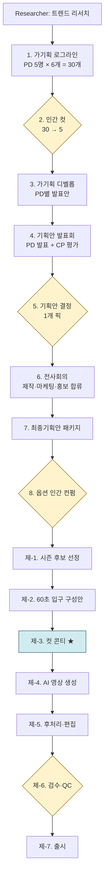

# ai-production

5일 동안 멀티 에이전트 시뮬레이션으로 AI 콘텐츠 프로덕션 한 사이클을 돌렸다.

페르소나 14명(PD 5명·CP·연구원·영상 제작 7인 팀)이 6번의 회의를 거쳐 30개 로그라인 → 5개 컷 → 7개 디벨롭 → 6편 시도 → 4편 출시까지 갔다. 그러다 마지막 회의에서 "단발 60초 입구"가 아니라 *시즌형 4부작*이 자연 발생했다 — **다시본다 / 한국의 시계**.

이 저장소는 그 1주일을 회의록·콘티·결정·검증 데이터까지 그대로 남긴 기록이다.

- 채널: [@dasibonda](https://www.youtube.com/@dasibonda) — 60초 입구 4편 출시
- 사이트: [dasibonda-site](../dasibonda-site/) (별도 작업 중)
- 케이스 디테일: [case-studies/dasibonda-cycle-001/](./case-studies/dasibonda-cycle-001/)

---

## 한 줄 요약

> AI 콘텐츠 PD의 일은 *현장 감독*이 아니라 *컷-레벨 디렉터*다.
> 그리고 페르소나 워크플로우 설계가 곧 *PD 채용*이다.

이 저장소는 그 두 가설을 직접 돌려서 증거를 남긴 기록이다.

---

## 1차 사이클 결과 — 다시본다 / 한국의 시계

**채널 4편 출시** (5/7 기준)

| YouTube | 제목 | 페르소나 |
|---|---|---|
| [shorts/1DU3Ciia_zw](https://www.youtube.com/shorts/1DU3Ciia_zw) | 1438년의 별: 조선은 하늘을 어떻게 기록했나 | PD2 과학 |
| [shorts/VKzCareMI4Q](https://www.youtube.com/shorts/VKzCareMI4Q) | 이름이 남지 않은 손 — 손기정 일장기를 지운 90초 | PD1 역사 |
| [shorts/an6yJBIoBG0](https://www.youtube.com/shorts/an6yJBIoBG0) | 일분군과 독립군이 서로를 보지 못한 이유 | PD1 역사 |
| [shorts/GPUglXi4o4c](https://www.youtube.com/shorts/GPUglXi4o4c) | 점심값 — 1만원의 무게 | PD3 사회 |

**시즌 1 컨셉 — 한국의 시계** (4부작, 자연 발생)

> 한국 반도체 활황은 이대로 갈 것인가.
> 어느 시계가 먼저 0이 되는지가 한국의 다음 5년이다.

```
1막  0:00–0:30   (2컷)  당신의 챗GPT 한 문장 → 데이터센터 → 칩
2막  0:30–2:20   (7컷)  HBM 안의 한국 90% → 1989 KAIST → 세 개의 시계
3막  2:20–3:00   (3컷)  세 시나리오 → 마무리
```

세 개의 시계:
- HBM4 양산 격차 시계 (삼성·SK 2026.2 vs 마이크론 추격)
- CXMT 추격 시계 (현재 −2~3년)
- AI 수요 지속 시계 (Mag7 capex +80% vs 매출 +15.5% 갭)

12컷 콘티 + 검증 데이터(17건 출처) → [case-studies/dasibonda-cycle-001/08_storyboards/](./case-studies/dasibonda-cycle-001/08_storyboards/)

---

## 메타 가설 2개

### 가설 1. 컷-레벨 디렉터

일반 방송 PD는 현장 즉흥 결정으로 산다 — NG·날씨·인터뷰이 변수.
AI 제작은 현장이 없다. 책임 무게중심이 **콘티 단계로 완전히 이동**한다.

→ 콘티 한 컷의 깊이가 결과물 품질의 90%를 결정한다.

**증거 — 컷당 통제 차원이 4단계로 진화**

| 단계 | 1: 7분 v1 | 2: 7분 v2 | 3: 60초 입구 | 4: 시즌 12컷 |
|---|---|---|---|---|
| 컷당 통제 차원 | 3 | 6 | 9 | **12** |

회의 002 → 006으로 가면서 컷 1개당 단어 수가 30 → 250으로 늘었다.

**한계 데이터** — 회의 003의 픽 *1936년 잉크 멀티스펙트럼* 이 회의 004에서 콘티 단계 픽션으로 판명. → 컷-레벨 디렉터 사고만으로는 사실/허구 경계를 못 잡는다. 워크플로우가 *사실 검증 stage*를 콘티 진입 전에 도입하며 진화.

### 가설 2. 워크플로우 설계 = PD 채용

다른 system prompt + 다른 모델 + 다른 temperature로 페르소나를 만들고, 결과를 블라인드로 평가해 *채용*한다.

**정량 증거 — overlap 40%** : 같은 30개 로그라인에 대해 CP 자동 top5 vs 인간 픽 일치율은 5개 중 2개 = 40% (`case-studies/dasibonda-cycle-001/04_human_cut/`).

평가 가중치가 다르면 픽이 갈린다. *어떤 가중치를 박은 페르소나를 채용할 것인가*가 결과를 결정한다.

**자연 분기 사건 — PD6** : 회의 005에서 *마음 직격* 기준이 도입되자 PD 1-5(B-목적위임형 단일 결)로는 *김진혁 결*을 못 잡음. PD6이 워크플로우 진행 중에 자연 발생. 회의 006의 *세 개의 시계*는 PD6의 첫 산출물.

**페르소나 채택률** (현재 4편 기준)
- PD1 역사: 50% (2편)
- PD2 과학: 25% (1편)
- PD3 사회: 25% (1편)
- PD4 글로벌·PD5 디지털: 0편

PD1의 미시사·작은 사물 결이 60초 입구에 가장 잘 맞고, PD4·PD5의 글로벌·메타는 60초로 압축되지 않는다.

**검증 한계** — PD 1-5가 모두 B-목적위임형 단일 결로 만들어짐. 본격 A/B/C 비교는 다음 사이클로.

자세한 검증 흔적은 [INSIGHTS.md](./INSIGHTS.md).

---

## 워크플로우 한 장



노란색 = 인간 개입 4곳. 파란색 = 컷 콘티 단계 (가설 1의 핵심).

자세한 다이어그램과 단계별 입출력 JSON 스키마는 [PIPELINE.md](./PIPELINE.md).

---

## 회의록 진화 (5일, 6번)

| 회차 | 일자 | 결정적 분기점 |
|---|---|---|
| 002 | 5/6 | 60초 단발 → 3분 12컷 확장 (1438년 별을 표준 결로) |
| 003 | 5/6 | 픽: 잉크 멀티스펙트럼 (이후 픽션으로 폐기) |
| **004** | 5/7 | 콘티 단계 픽션 발각 → **사실 검증 stage 신규 도입** |
| 005 | 5/7 | "마음 직격" 기준 추가 → **PD6 (김진혁 결) 자연 발생** |
| 006 | 5/7 | 사용자 직격 질문 (반도체) → **시즌형 4부작 자연 발생** |

5번의 회의록은 매번 *금지 결*과 *원하는 결*을 누적한다. 이 누적이 다음 사이클의 평가 함수가 된다.

전체 회의록 6편 + 단계별 narrative → [case-studies/dasibonda-cycle-001/07_conference_evolution/](./case-studies/dasibonda-cycle-001/07_conference_evolution/)

---

## 폴더 가이드

```
ai-production/
├── README.md                      이 문서
├── PIPELINE.md                    워크플로우 풀버전 (Mermaid + 단계별 스키마)
├── INSIGHTS.md                    메타 가설 2개 검증 결과
├── DECISIONS.md                   주요 의사결정 로그 (5/3 → 5/7)
│
├── case-studies/
│   └── dasibonda-cycle-001/       1차 사이클 케이스 (다시본다 / 한국의 시계)
│       ├── README.md              5일 사이클 narrative
│       ├── 01_research/           트렌드 리서치 입력
│       ├── 02_loglines/           PD 5명 × 6 = 30개 로그라인
│       ├── 03_cp_evaluation/      CP 자동 평가
│       ├── 04_human_cut/          인간 컷팅 (overlap 40% 첫 측정)
│       ├── 05_developed/          7개 디벨롭
│       ├── 06_pivot_to_60sec/     단발 → 60초 입구 피벗
│       ├── 07_conference_evolution/  회의록 6편 + narrative
│       ├── 08_storyboards/        콘티 깊이 4단계 비교
│       ├── 09_outputs/            영상 출력 + 채택률 표
│       └── 10_site/               연결 사이트 안내
│
├── personas/                      에이전트 페르소나 14개
│   ├── researcher.md              트렌드 리서치
│   ├── cp_senior.md               CP (시니어 평가자)
│   ├── pd1_history.md ~ pd5_digital.md   PD 5명 (도메인별)
│   └── seedance/                  컷 콘티 → 영상 프롬프트 변환 7인 팀
│
├── docs/
│   ├── GETTING_STARTED.md         자기 채널에 적용하는 5단계
│   ├── ADAPT_TO_YOUR_CHANNEL.md   채널별 페르소나·톤 가이드
│   └── HUMAN_INTERVENTION.md      인간 개입 4곳 디테일
│
├── pipeline/                      단계별 프롬프트·스키마 (다음 사이클)
└── tools/                         보조 스크립트 (다음 사이클)
```

---

## 받아써보기

자기 채널·주제로 사이클을 돌리려면 `personas/` 14개를 도메인 강점 영역에 맞게 재작성하면 된다. 5단계 적용 가이드 → [docs/GETTING_STARTED.md](./docs/GETTING_STARTED.md). 다른 채널(역사·과학·시사 등) 톤 가이드 → [docs/ADAPT_TO_YOUR_CHANNEL.md](./docs/ADAPT_TO_YOUR_CHANNEL.md).

이건 EBS만의 톤이 아니다. 페르소나의 정체성·평가 기준만 자기 채널 톤으로 갈아끼우면 된다.

---

## 회고 글 (블로그)

이 1주일을 자기 손으로 써본 회고 4편 — [blog/](./blog/).

1. AI가 영상 만드는 시대에, PD는 무엇을 결정하는가
2. PD 5명을 만들어 한 회의에 앉혀봤다
3. 1분 영상은 단발 콘텐츠가 아니다 — 시즌의 입구다
4. AI 영상의 환각, 결재선의 어디인가

---

## 라이선스

MIT — 페르소나 정의·파이프라인·문서.
`case-studies/dasibonda-cycle-001/` 안의 영상·내레이션·콘티는 *다시본다* 채널 자체 저작물로, 인용 시 출처 표기를 부탁한다.
