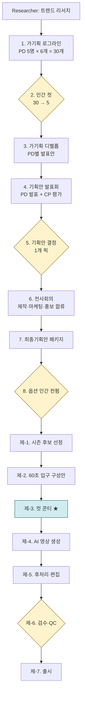

# ai-production

AI 콘텐츠 프로덕션 회사를 멀티 에이전트로 시뮬레이션한다.

기획부터 발표회·전사회의·제작·QC·출시까지 한 사이클을, 사람 한 명이 아니라 페르소나 14명(PD·CP·연구원·프롬프트 팀)이 돌린다. 결과물은 **60초 입구 영상 1편 + 20분 8부작 시즌 바이블**이다.

이 저장소는 두 가지 동시에 한다.
- EBS PD 경력직 채용 어필용 포트폴리오 — "AI 시대의 PD가 무엇을 해야 하는가"에 대한 답.
- 누구나 받아써서 자기 채널·자기 주제로 사이클을 돌릴 수 있는 **재현 가능한 프로덕션 시스템**.

연결된 데모 채널은 **다시본다 / 한국의 시계** — *한국 반도체 활황은 이대로 갈 것인가*를 3분 1편으로 압축한 1차 사이클 결과물이다.

> See also: [dasibonda-site](../dasibonda-site/) — 채널 사이트(별도 작업 중)

---

## 한 줄 요약

> "AI 콘텐츠 PD의 일은 *현장 감독*이 아니라 *컷-레벨 디렉터*다. 그리고 워크플로우 설계가 곧 PD 채용이다."

이 저장소는 그 가설 두 개를 *직접 돌려서* 증거를 남긴 시스템이다.

---

## 메타 가설 2개

### 가설 1. AI 제작 PD = 컷-레벨 디렉터

일반 방송 PD는 현장 즉흥 결정으로 산다 — NG·날씨·인터뷰이 변수.
AI 제작은 현장이 없다. 책임 무게중심이 **콘티 단계로 완전히 이동**한다.

→ 콘티 한 컷의 깊이가 결과물 품질의 90%를 결정한다.

**증거**: `case-studies/dasibonda-cycle-001/` 안의 회의록 진화 흔적.
회의 002 → 003 → 004 → 005 → 006으로 갈수록 컷 안의 *beat 수*가 늘고, *카메라 무빙·거리·렌즈*가 디테일해진다. 컷 1개당 단어 수가 30 → 250으로 늘었다.

**한계 데이터**: 회의 003의 픽 *1936년 잉크 멀티스펙트럼*이 회의 004에서 콘티 단계 픽션으로 판명, EBS 신뢰성 직격 위기. → 컷-레벨 디렉터의 사고가 PD 핵심 역량인 것은 맞지만, 콘티 깊이만으로는 사실/허구 경계를 못 잡는다. 워크플로우 자체가 *사실 검증 stage*를 콘티 진입 전에 도입하며 진화.

### 가설 2. 워크플로우 설계 = 'PD 채용' / 운영 = '정해진 워크플로우'

PD A·B·C 페르소나를 다른 system prompt + 다른 모델 + 다른 temperature로 만든다.
같은 입력을 던지고 결과를 블라인드 평가한다. 좋은 애를 운영에 *채용*한다.

이 시점부터 운영은 정해진 워크플로우가 된다. PD를 매번 새로 뽑지 않는다.

**정량 증거**: `runs/cycle-001/04_human_cut.json` — 같은 30개 로그라인에 대해 CP 자동 top5 vs 인간 픽 **overlap 40%**. 평가 가중치가 다르면 픽이 갈린다. *어떤 가중치를 박은 페르소나를 채용할 것인가*가 결과를 결정한다.

**자연 분기 사건**: 회의 005에서 *마음 직격* 기준이 도입되자 PD 1-5(B-목적위임형 단일 결)로는 *김진혁 결*을 못 잡음. PD6이 워크플로우 진행 중에 자연 발생. 회의 006의 *세 개의 시계*는 PD6의 첫 산출물.

**검증 한계**: PD 1-5가 모두 B-목적위임형 단일 결로 만들어짐. 본격 A/B/C 비교는 다음 사이클로.

자세한 검증 흔적은 [INSIGHTS.md](./INSIGHTS.md).

---

## 워크플로우 한 장



**노란색 = 인간 개입 4곳.** 자세한 다이어그램과 단계별 입출력 JSON은 [PIPELINE.md](./PIPELINE.md).

**파란색 = 컷 콘티 [제-3]**. 가설 1의 핵심 단계.

---

## 1차 사이클 결과 — *다시본다 / 한국의 시계*

질문: 한국 반도체 활황은 이대로 갈 것인가.
포맷: 3분(180초) × 12컷 × 15초. 16:9. 한국어 보이스오버. 마무리 *"다시 본다."*

```
1막  0:00–0:30   (2컷)  당신의 챗GPT 한 문장 → 데이터센터 → 칩
2막  0:30–2:20   (7컷)  HBM 안의 한국 90% → 1989 KAIST → 세 개의 시계
3막  2:20–3:00   (3컷)  세 시나리오 → 마무리
```

핵심 발견 — 한국 반도체의 미래는 **세 개의 시계**다.
- HBM4 양산 격차 시계 (삼성·SK 2026.2 vs 마이크론 추격)
- CXMT 추격 시계 (현재 −2~3년)
- AI 수요 지속 시계 (Mag7 capex +80% vs 매출 +15.5% 갭)

> 어느 시계가 먼저 0이 되는지가 한국의 다음 5년이다.

전체 회의록 6편 + 12컷 콘티 + 검증 데이터(17건 출처)는 [case-studies/dasibonda-cycle-001/](./case-studies/dasibonda-cycle-001/)에 있다.

---

## 사용법

```bash
# 1. 자기 채널/주제로 페르소나 커스터마이즈
cp -R personas/ my-channel-personas/
# personas/pd1_history.md 등 도메인 강점 영역 재작성

# 2. 트렌드 리서치 입력 준비 (researcher.md 참고)
# 3. 1주기 돌리기 — pipeline/ 단계별 프롬프트 따라가기
# 4. 결과물은 case-studies/your-channel-cycle-001/ 에 저장
```

자세한 5단계 가이드는 [docs/GETTING_STARTED.md](./docs/GETTING_STARTED.md).
다른 채널(역사·과학·시사 등)로 옮길 때는 [docs/ADAPT_TO_YOUR_CHANNEL.md](./docs/ADAPT_TO_YOUR_CHANNEL.md).

---

## 폴더 가이드

```
ai-production/
├── README.md                      이 문서
├── PIPELINE.md                    워크플로우 풀버전 (Mermaid + 단계별 스키마)
├── INSIGHTS.md                    메타 가설 2개 검증 결과
├── DECISIONS.md                   주요 의사결정 로그 (5/3 → 5/7)
│
├── docs/
│   ├── GETTING_STARTED.md         자기 채널에 적용하는 5단계
│   ├── ADAPT_TO_YOUR_CHANNEL.md   채널별 페르소나·톤 가이드
│   └── HUMAN_INTERVENTION.md      인간 개입 4곳 디테일
│
├── personas/                      에이전트 페르소나 14개
│   ├── README.md                  페르소나 카테고리·모델·역할 정리
│   ├── researcher.md              트렌드 리서치
│   ├── cp_senior.md               CP (시니어 평가자)
│   ├── pd1_history.md ~ pd5_digital.md   PD 5명 (도메인별)
│   └── seedance/                  컷 콘티 → 영상 프롬프트 변환 7인 팀
│
├── pipeline/                      단계별 프롬프트·스키마 (예정)
├── case-studies/
│   └── dasibonda-cycle-001/       1차 사이클 케이스 (다시본다 / 한국의 시계)
└── tools/                         보조 스크립트 (예정)
```

---

## 톤 — 적자고 한 것 / 적지 않기로 한 것

EBS 공교양 결을 따른다.
- 자극적 폭로·썸네일 문법 X.
- "AI로 더 빠르게" X / **"AI로 더 깊게"** O — 학습 효과·고증·신뢰성 우선.
- AI 환각 1건이면 EBS 신뢰 파괴 — 자동 QC + 사람 최종 검수 필수.
- 단정 미래 예측 X. 시나리오 3개 조건부.

이건 EBS만의 톤이 아니다. 받아쓰는 사람이 자기 채널 톤으로 페르소나의 정체성·평가 기준만 갈아끼우면 된다.

---

## 기여

이 저장소는 단일 사이클의 케이스 스터디 + 프레임워크다. 풀리퀘스트로 다른 채널의 사이클 결과를 `case-studies/` 아래 추가하는 형태로 기여 가능.

페르소나·파이프라인 자체에 대한 제안은 이슈로.

---

## 라이선스

MIT — 페르소나 정의·파이프라인·문서 모두.
다만 `case-studies/dasibonda-cycle-001/` 안의 영상·내레이션·콘티는 **다시본다** 채널 자체 저작물로, 인용 시 출처 표기를 부탁한다.
